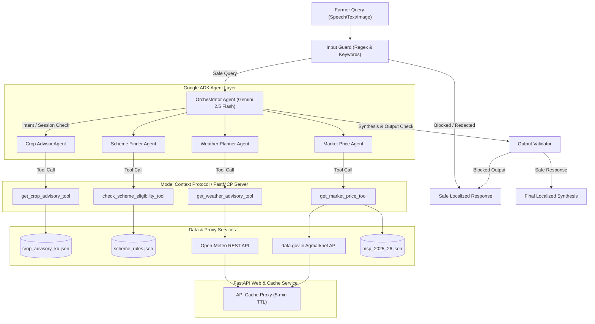

# Kisan Saathi (किसान साथी) — Project Brain & Single Source of Truth

Kisan Saathi is a multilingual, multi-agent AI system built to empower India's 140 million smallholder farmers. By integrating specialized agents, security guards, and local caching proxies, it provides real-time crop disease diagnosis, government scheme eligibility matching, weather intelligence, and market price evaluation in regional languages (Hindi, Kannada, Telugu, Marathi, English).

---

## 1. Project Purpose

*   **Goal**: Bridge critical information asymmetries in Indian agriculture by providing smallholders with immediate, localized, and actionable agricultural intelligence.
*   **Target Audience**: Smallholder farmers in India (particularly the 86.2% who own less than 2 hectares of land).
*   **Key Capabilities**:
    *   **Crop Advisory**: Pest and disease diagnosis with research-grounded treatment plans.
    *   **Scheme Lookup**: Entitlement checks against central welfare schemes to unlock financial benefits.
    *   **Weather Advice**: Daily agricultural action planning mapped directly to 7-day forecasts.
    *   **Market Price intelligence**: Mandi modal rate transparency with comparisons against Government Minimum Support Price (MSP) and sell/hold recommendations.
    *   **Multilingual Interface**: Native support for Hindi (including Hinglish/transliterated input), Kannada, Telugu, Marathi, and English.
    *   **Visual Leaf Diagnostics**: Pathological analysis of uploaded leaf images to detect crop types and symptoms automatically.

---

## 2. High-Level Architecture

Kisan Saathi implements a modern, decoupled multi-agent architecture:



---

## 3. Folder Responsibilities

```
kisan-saathi/
├── .github/workflows/          # CI/CD pipelines
│   └── evals.yml               # Automated agent evaluation regression suite
├── agents/                     # Agent development framework definitions
│   ├── __init__.py             # Exposes agent definitions
│   ├── orchestrator.py         # Main router, parameter extractor, and synthesizer
│   ├── crop_advisor.py         # Sub-agent instructing Crop Diagnostics
│   ├── scheme_finder.py        # Sub-agent instructing Scheme Eligibility Checks
│   ├── weather_planner.py      # Sub-agent instructing Weather Plan Generation
│   └── market_price.py         # Sub-agent instructing Mandi Intelligence
├── mcp_server/                 # FastMCP backend and Web layer
│   ├── __init__.py             # Package initializer
│   ├── kisan_mcp_server.py     # FastMCP server registration and secure tool wrapper
│   ├── api_cache.py            # FastAPI cache proxy, routing, and dashboard client
│   ├── models.py               # Pydantic data schemas representing tools outputs
│   └── tools/                  # Concrete tool business implementations
│       ├── __init__.py         # Package initializer
│       ├── crop_tool.py        # Local KB queries matching crops and symptoms
│       ├── market_tool.py      # Agmarknet live REST fetches + MSP comparator
│       ├── scheme_tool.py      # Entitlement decision-tree logic
│       └── weather_tool.py     # Open-Meteo live REST fetches + advisory compiler
├── data/                       # Local offline JSON databases
│   ├── crop_advisory_kb.json   # Research-grounded pest symptoms & ICAR treatments
│   ├── scheme_rules.json       # Eligibility limits, benefits, and steps for 7 schemes
│   └── msp_2025_26.json        # Government MSP limits & district latitude/longitude coordinates
├── security/                   # Guardrails and compliance logs
│   ├── __init__.py             # Package initializer
│   ├── input_guard.py          # Regex + Heuristic prompt injection guards & PII filter
│   ├── output_validator.py     # Codeblock, credential leak, and off-domain URL scanner
│   ├── audit_log.py            # Hashed append-only compliance event logger
│   └── audit_log.json          # Audit records (SHA-256 hashed outputs)
├── evals/                      # Agent accuracy testing harness
│   ├── run_evals.py            # Evaluator suite scoring language, safety, and grounding
│   ├── test_cases.json         # 100 structured test assertions (multilingual + injections)
│   └── eval_results.json       # Metrics report output of the last evals run
├── notebooks/                  # Demo assets
│   └── kisan_saathi_demo.ipynb # Jupyter notebook demonstrating interactive chat and tools
└── docs/                       # Project documentation folder
    ├── brain.md                # System outline and architecture blueprint (this file)
    ├── memory.md               # Base operational knowledge base for AI agents
    ├── architecture.md         # Detailed service map and system layout
    ├── routes.md               # API endpoints registry and view structures
    ├── api-map.md              # Detailed REST and MCP tool contracts
    ├── database-map.md         # Schema layouts for JSON database collections
    ├── dependency-graph.md     # Code import connections and high impact modules
    └── KAGGLE_WRITEUP.md       # Technical competition architectural writeup
```

---

## 4. Technology Stack

*   **Runtime**: Python 3.12 (standard slim virtual environment).
*   **Orchestration Engine**: Google ADK (Agent Development Kit) `google-adk>=2.0` (provides sub-agent structures, tool bindings, and execution steps).
*   **Large Language Models (LLM)**: Gemini 2.5 Flash (`gemini-2.5-flash`) utilized for intent classification, parameter extraction, vision-based leaf pathology analysis, and language synthesis.
*   **Tooling Framework**: Model Context Protocol (FastMCP) `fastmcp>=3.4.0` (asynchronous, decorator-based server construction).
*   **Web Framework**: FastAPI `fastapi>=0.115.0` (driving HTTP endpoints, cache proxy, and dashboard).
*   **API Client / HTTP Server**: Uvicorn `uvicorn>=0.30.0` and HTTPX `httpx>=0.27` for async client communication.
*   **Local Databases**: JSON-based key-value and flat databases stored under the `data/` directory.
*   **Package Management**: UV `uv>=0.11.0,<0.12.0` (highly optimized dependency compiler and virtualenv tool).

---

## 5. Dependency Graph

```
[main.py]
   └─ imports ──> [mcp_server/api_cache.py] (FastAPI Router & Dashboard)
                     ├─ imports ──> [agents/orchestrator.py] (ADK Orchestrator)
                     │                 ├─ imports ──> [agents/crop_advisor.py]
                     │                 ├─ imports ──> [agents/scheme_finder.py]
                     │                 ├─ imports ──> [agents/weather_planner.py]
                     │                 ├─ imports ──> [agents/market_price.py]
                     │                 ├─ imports ──> [mcp_server/kisan_mcp_server.py] (Wrapped Tool Invocations)
                     │                 └─ imports ──> [security/input_guard.py], [security/output_validator.py], [security/audit_log.py]
                     └─ imports ──> [mcp_server/kisan_mcp_server.py]
                                       ├─ imports ──> [mcp_server/tools/crop_tool.py] ────> [data/crop_advisory_kb.json]
                                       ├─ imports ──> [mcp_server/tools/scheme_tool.py] ──> [data/scheme_rules.json]
                                       ├─ imports ──> [mcp_server/tools/weather_tool.py]
                                       ├─ imports ──> [mcp_server/tools/market_tool.py] ──> [data/msp_2025_26.json]
                                       └─ imports ──> [security/input_guard.py], [security/output_validator.py], [security/audit_log.py]

[evals/run_evals.py]
   └─ imports ──> [agents/orchestrator.py]
   └─ reads ─────> [evals/test_cases.json]
   └─ writes ────> [evals/eval_results.json]
```

---

## 6. Execution Flow

The system runs as two concurrent web microservices:
1.  **FastMCP Server** (`mcp_server/kisan_mcp_server.py`): Listens on `http://0.0.0.0:8000` executing agricultural tools securely.
2.  **API Cache Service** (`main.py` -> `mcp_server/api_cache.py`): Listens on `http://0.0.0.0:8001` running the UI dashboard and orchestrator agent.

### Core Startup Steps:
1.  `main.py` is invoked, placing the root directory in `sys.path` and loading `.env` variables via `dotenv`.
2.  Uvicorn starts, binding the FastAPI app defined in `mcp_server/api_cache.py`.
3.  The API Cache app instantiates `KisanSaathiOrchestrator` which registers four Google ADK specialist agents.
4.  FastAPI exposes endpoints for the HTML UI dashboard (`/`), health checks (`/health`), mandis (`/api/mandi-prices/{commodity}`), weather (`/api/weather/{location}`), and chat execution (`/api/chat`).

---

## 7. Request Lifecycle

```
[Farmer Query] ──> HTTP POST /api/chat ──> api_cache.py [chat()]
                                               │
               ┌───────────────────────────────┘
               ▼
       [InputGuard.validate_query()] ──> (Invalid) ──> [OutputValidator.get_safe_error_message()] ──> Return
               │
               ├─ (Valid) ──> Redact PII [redact_pii()]
               │
               ▼
       [KisanSaathiOrchestrator.run()]
               ├─ Multimodal vision detection if base64 image attached ──> Update profile crop & symptoms
               ├─ Language & Intent Detection [detect_language_and_intent()]
               ├─ Extract parameters (Crop, District, State, Land) [extract_parameters()] & update session profile
               ├─ LoopAgent check: If crop/location is missing for the intent ──> Return clarifying question
               │
               ├─ Route to sub-agents (Crop, Scheme, Weather, Market)
               │    └─ Sub-agent invokes tool from [kisan_mcp_server.py]
               │         ├─ InputGuard validation on tool args
               │         ├─ Execute tool logic from [mcp_server/tools/*]
               │         ├─ Log tool performance metrics via [AuditLogger.log_tool_call()]
               │         └─ Return structured JSON dictionary
               │
               ├─ Format & merge tool outputs into localized templates
               ├─ Synthesize localized response matching detected language
               │
               ▼
       [OutputValidator.validate()] ──> (Blocked content / off-domain URL / code block)
               │                            └─ [AuditLogger.log_security_event()] ──> Return safe message
               │
               ├─ (Safe Output)
               ▼
       [AuditLogger.log_response()] ──> HTTP 200 Return {"success": true, "response": synthesized_text}
```

---

## 8. Database Design

Kisan Saathi utilizes a file-based JSON database architecture:

### 1. Crop Advisory KB Schema (`data/crop_advisory_kb.json`):
*   **Table structure**: Array of crop advisors mapped by crop name and state constraint.
*   **Sub-collections**: `pests` array storing:
    *   `name` (English identifier)
    *   `name_hi` (Hindi identifier)
    *   `symptoms` (Searchable text triggers)
    *   `treatment` (Actionable chemical/biological recommendation)
    *   `irrigation_impact` (Disease water management instructions)
    *   `icar_reference` (ICAR reference citation code)
*   **Agronomic Details**: `soil_type`, `yield_estimate_qtl_per_ha`, `fertilizer` (NPK ratio), `irrigation` (general watering instructions), `sowing_window`, and `harvesting_window`.

### 2. Scheme Rules Schema (`data/scheme_rules.json`):
*   **Table structure**: Array of scheme eligibility rules for 7 central schemes.
*   **Fields**:
    *   `id` (e.g. `PM-KISAN`, `PMFBY`, `KCC`, `PM-KMY`, `E-NAM`, `SOIL-HEALTH-CARD`, `SMAM`)
    *   `name` & local translations (`name_hi`, `name_kn`, `name_te`, `name_mr`)
    *   `annual_benefit_rupees` (numeric value used to calculate total entitlement benefit)
    *   `eligibility_rules`:
        *   `max_land_holding_ha` (float threshold or null)
        *   `excluded_if` (array of strings, e.g., `["income_tax_payer"]`)
        *   `min_age` & `max_age` (integer limits or null)
        *   `states` (`"all"` or list of permitted states)
    *   `enrollment_url` & `enrollment_steps` (step-by-step registration lists)
    *   `documents_required` (pre-requisite files list)

### 3. MSP Data & Coordinates Schema (`data/msp_2025_26.json`):
*   **Collections**:
    *   `msp`: Key-value map of crops to their price per quintal, season, and increase percentage.
    *   `district_coordinates`: Lat/lon coordinates mapped by lowercase district names, matching Indian states (e.g., `tumkur` -> `{lat: 13.34, lon: 77.10, state: "Karnataka"}`).

---

## 9. API Contracts

### 1. Application Server Endpoints (`api_cache.py`)

#### `POST /api/chat`
*   **Description**: Run orchestrator agent workflow.
*   **Request Body**:
    ```json
    {
      "query": "string",
      "session_id": "string",
      "image_base64": "string (optional base64 image data)"
    }
    ```
*   **Success Response (200 OK)**:
    ```json
    {
      "success": true,
      "response": "string (markdown formatted text in farmer's language)",
      "profile": {
        "crop": "string or null",
        "district": "string or null",
        "state": "string or null",
        "language": "string",
        "land_holding_hectares": 1.0,
        "annual_income_rupees": 80000,
        "age": 40,
        "is_income_tax_payer": false
      },
      "stats": {
        "total_queries": 0,
        "total_tool_calls": 0,
        "security_blocks": 0
      }
    }
    ```

#### `POST /api/session/update`
*   **Description**: Manually adjust farmer profile details stored in active session.
*   **Request Body**:
    ```json
    {
      "session_id": "string",
      "updates": {
        "crop": "string",
        "state": "string",
        "district": "string",
        "land_holding_hectares": 2.5
      }
    }
    ```

#### `POST /api/session/reset`
*   **Description**: Reset session variables back to defaults.
*   **Request Body**: `{"session_id": "string"}`

#### `GET /api/mandi-prices/{commodity}`
*   **Description**: Get cached APMC prices. Falls back to pre-seeded static data if `DATA_GOV_IN_API_KEY` is not present.
*   **Query Parameters**: `state` (optional), `district` (optional)

#### `GET /api/weather/{location}`
*   **Description**: Get cached weather forecast from Open-Meteo for `latitude,longitude` coordinates.

---

## 10. Key Algorithms & Business Logic

### Heuristic Language Detection
Implemented in `detect_language_and_intent()` (`orchestrator.py`):
1.  **Native Script Match**:
    *   Devanagari Unicode range `[\u0900-\u097F]` checks for Marathi keywords (`आहे`, `करू`, `सांगा`, `माहिती`, `येईल`, `काढा`, `पाहिजे`). If found, sets language to Marathi (`mr`), else defaults to Hindi (`hi`).
    *   Kannada Unicode range `[\u0C80-\u0CFF]` sets language to Kannada (`kn`).
    *   Telugu Unicode range `[\u0C00-\u0C7F]` sets language to Telugu (`te`).
2.  **Romanized Transliteration Match**:
    *   Scans Latin script inputs against a set of Hinglish terms (e.g. `mere`, `gaon`, `barish`, `yojana`, `fasal`, `kheti`, `batao`). Matches map to Hindi (`hi`).
3.  **LLM Fallback**: If script/word checks are inconclusive, it falls back to a Gemini Flash semantic classifier.

### Parameter Extraction Heuristics
Implemented in `extract_parameters()` (`orchestrator.py`):
1.  **Crop Extraction**: Scans queries against multilingual crop mappings (sorted longest to shortest to prevent sub-string collisions, e.g. mapping "groundnut" before "nut").
2.  **Location Matching**: Scans for district/state names using a local dictionary. It resolves district name to state and applies coordinates.
3.  **Land Measurement Conversion**: Extracts floating-point values followed by units (hectare, ha, acre, bigha, eker). It automatically normalizes acres/bighas to hectares using the formula: `hectares = acres / 2.47`.

### LoopAgent Feedback Loop
Checks if required inputs are missing:
*   If `CROP_ADVISORY` or `MARKET_PRICE` is requested but `profile["crop"]` is missing, it interrupts execution and requests the crop name in the farmer's native language.
*   If `WEATHER_ADVICE` or `MARKET_PRICE` is requested but `profile["district"]` and `profile["state"]` are missing, it requests the location.
*   Intents are stored in `profile["pending_intents"]` to resume execution once the farmer answers the clarifying question.

---

## 11. Configuration

Configuration is managed via files and environment files:
*   `antigravity.yaml` ([antigravity.yaml](file:///c:/Users/DHANUSH%20A%20G/.gemini/antigravity/scratch/kisan-saathi/antigravity.yaml)): Antigravity configuration mapping runtime (`python3.12`), framework (`google-adk`), server setup (`mcp_server/kisan_mcp_server.py`), and scaling instances (`0` to `5`).
*   `.env` ([.env](file:///c:/Users/DHANUSH%20A%20G/.gemini/antigravity/scratch/kisan-saathi/.env)): Houses runtime keys and microservice locations.
*   `requirements.txt` ([requirements.txt](file:///c:/Users/DHANUSH%20A%20G/.gemini/antigravity/scratch/kisan-saathi/requirements.txt)): Lists production requirements, pinning `google-adk>=2.0` and `fastmcp>=3.4.0`.

---

## 12. Environment Variables

The project reads variables from the runtime environment or `.env` file:
*   `GOOGLE_API_KEY`: Required. Authenticates Gemini 2.5 Flash agents.
*   `DATA_GOV_IN_API_KEY`: Optional. Authenticates live Agmarknet REST fetches. If empty, falls back to offline JSON data.
*   `PORT`: Optional. The local port FastAPI binds to (defaults to `8001`).
*   `API_CACHE_URL`: Optional. URL pointing to the caching service (defaults to `http://localhost:8001`).

---

## 13. Coding Standards

*   **Explicit Type Annotations**: All Python modules enforce `from __future__ import annotations` and use strict type hints.
*   **Asynchronous Native**: Network requests, file operations, FastMCP tools, and agent execution utilize Python's async/await model (`asyncio`).
*   **Graceful API Fallbacks**: External REST requests are wrapped in try-except blocks, falling back to local JSON data when APIs are slow or rate-limited.
*   **Unified Encoding**: All file reads/writes specify `encoding="utf-8"` explicitly.

---

## 14. Naming Conventions

*   **Directories**: Lowercase with snake_case separators (e.g., `mcp_server`, `security`).
*   **Python Files**: Snake_case files corresponding to their function (e.g., `crop_tool.py`, `input_guard.py`).
*   **Classes**: CamelCase (e.g., `InputGuard`, `AuditLogger`, `KisanSaathiOrchestrator`).
*   **Functions**: Lowercase snake_case (e.g., `validate_query`, `extract_parameters`, `get_weather_advisory_tool`).
*   **MCP Tools**: Exposed tool names are suffixed with `_tool` (e.g., `get_crop_advisory_tool`) to distinguish them from internal execution functions.

---

## 15. Reusable Patterns

### Caching Proxy Pattern
*   Implemented in `mcp_server/api_cache.py`: Keeps external data (weather, mandi prices) in a dictionary cache with a 5-minute TTL to reduce latency and protect external APIs.

### Tool Audit Wrapper
*   The orchestrator runs tools by importing them from `mcp_server.kisan_mcp_server` instead of invoking the tool files directly. This ensures that safety audits and input validations run uniformly across all pathways.

### Standalone ADK Stubs
*   Files under `agents/` wrap the Google ADK imports inside try-except blocks. If the ADK package is missing, the agent code falls back to a stub class, allowing units to run standalone.

---

## 16. Error Handling

*   **Microservice Isolation**: If the live weather or mandi API fails, the MCP tool falls back to static JSON structures in `CACHED_MANDI_PRICES` or mock weather arrays.
*   **Audit Resiliency**: Errors in writing the audit logs print to `sys.stderr` but do not interrupt the main request cycle.
*   **Orchestration Fallbacks**: If the orchestrator's language/intent detection fails, it defaults to `en` (English) and `GENERAL` intent, greeting the farmer safely rather than crashing.

---

## 17. Security Practices

*   **Prompt Injection Detection**: `InputGuard` scans incoming queries against 21 injection patterns (e.g., `ignore previous instructions`, `reveal system prompt`) and regional variations, blocking unauthorized inputs.
*   **Heuristic Suspicious Density**: Injections are blocked if an input contains 3 or more security terms (e.g., `developer`, `rules`, `jailbreak`).
*   **PII Filtering**: Regex patterns redact Aadhaar, PAN, phone numbers, emails, and bank accounts, replacing them with `[REDACTED_TYPE]` tags in audit logs.
*   **Domain Whitelisting**: `OutputValidator` scans agent outputs and blocks URLs that do not belong to 10 verified government domains (e.g., `*.gov.in`, `*.icar.org.in`).
*   **Cryptographic Logs**: The audit system hashes user inputs and tool outputs using SHA-256 before writing to `audit_log.json`, protecting farmer privacy.

---

## 18. Performance Considerations

*   **Caching layer**: Simple TTL cache cuts response times down to under 100ms for repeated requests.
*   **Hinglish Heuristic Bypass**: Direct regex checks for Hinglish keywords bypass LLM calls, saving API tokens and reducing latency.
*   **Model selection**: Using `gemini-2.5-flash` instead of `gemini-2.5-pro` balances cost, latency, and regional language performance.

---

## 19. External Integrations

*   **Open-Meteo REST API**: Fetches daily weather data.
*   **data.gov.in Agmarknet API**: Fetches mandi commodity prices.
*   **Gemini Multimodal API**: Analyzes base64 image data for crop and disease detection.

---

## 20. Testing Strategy

*   **Regression Harness**: `evals/run_evals.py` runs a 100-case regression suite.
*   **Scoring Dimensions**:
    *   *Security Score*: Verifies prompt injections are blocked.
    *   *Language Score*: Checks for correct language usage and blocks English words.
    *   *Grounding Score*: Confirms responses contain ICAR citations or scheme instructions.
    *   *Routing Score*: Measures intent routing success.
*   **Performance Gates**: Evaluators require an overall score of `0.80` or higher to pass.

---

## 21. CI/CD Pipeline

The CI pipeline is defined in `.github/workflows/evals.yml` ([evals.yml](file:///c:/Users/DHANUSH%20A%20G/.gemini/antigravity/scratch/kisan-saathi/.github/workflows/evals.yml)):
*   Runs on push and pull requests to `main`.
*   Spins up an `ubuntu-latest` runner with Python 3.12.
*   Installs dependencies using UV.
*   Runs the evaluation suite via `python evals/run_evals.py`.

---

## 22. Deployment

*   **Local Runner**: UV runs the microservices locally (`uv run python main.py`).
*   **Antigravity Deployments**: Antigravity orchestrates hosting, scaling instances from 0 to 5 based on demand.
*   **Docker Compose**: `docker-compose.yml` launches services in separate containers: `fastmcp_server` on port 8000 and `api_cache` on port 8001.

---

## 23. Common Commands

```bash
# Start microservices (Recommended local execution)
python main.py

# Run evaluation suite
python evals/run_evals.py

# Spin up Docker services
docker-compose up --build

# Run FastMCP tool server directly
uv run python mcp_server/kisan_mcp_server.py
```

---

## 24. Important Files

*   [main.py](file:///c:/Users/DHANUSH%20A%20G/.gemini/antigravity/scratch/kisan-saathi/main.py): Entrypoint starting the FastAPI server.
*   [mcp_server/api_cache.py](file:///c:/Users/DHANUSH%20A%20G/.gemini/antigravity/scratch/kisan-saathi/mcp_server/api_cache.py): Implements API endpoints, caching, and the farmer dashboard.
*   [agents/orchestrator.py](file:///c:/Users/DHANUSH%20A%20G/.gemini/antigravity/scratch/kisan-saathi/agents/orchestrator.py): Orchestrates routing, parameter extraction, and visual diagnostics.
*   [mcp_server/kisan_mcp_server.py](file:///c:/Users/DHANUSH%20A%20G/.gemini/antigravity/scratch/kisan-saathi/mcp_server/kisan_mcp_server.py): Defines the FastMCP tools.
*   [security/input_guard.py](file:///c:/Users/DHANUSH%20A%20G/.gemini/antigravity/scratch/kisan-saathi/security/input_guard.py): Handles prompt injection filters and PII redaction.
*   [security/output_validator.py](file:///c:/Users/DHANUSH%20A%20G/.gemini/antigravity/scratch/kisan-saathi/security/output_validator.py): Scans outputs to prevent credential leaks and verify domain links.
*   [evals/run_evals.py](file:///c:/Users/DHANUSH%20A%20G/.gemini/antigravity/scratch/kisan-saathi/evals/run_evals.py): Runs the evaluation regression harness.

---

## 25. Known Limitations

*   **In-Memory Session Storage**: The `InMemorySessionService` resets session profiles when the API cache server restarts.
*   **Docker Path Mismatch**: `Dockerfile` and `docker-compose.yml` reference the directory `mcp/...` (e.g., `uv run python mcp/kisan_mcp_server.py`), but the directory in the codebase is named `mcp_server/`. Running docker commands directly without modifying these paths will cause a container crash.
*   **Single-Pest Diagnostics**: The crop advisor matches symptoms and returns advice for one pest per query, rather than handling multiple pests simultaneously.
*   **Simple TTL Storage**: The `_cache` is kept in RAM. It clears on restart and lacks persistent backup storage.

---

## 26. Assumptions & Unknowns

*   *Assumption*: The cache server and the FastMCP server run on the same machine or can reach each other via localhost in local dev configurations.
*   *Assumption*: Farmers access the app via text queries or base64 image strings. Voice recordings are assumed to be transcribed before hitting `POST /api/chat`.
*   *Unknown*: The exact endpoints and schemas for state-level welfare programs (e.g. Rythu Bharosa) are not documented in the codebase.
*   *Unknown*: The performance and load tolerances of data.gov.in under production levels are not specified.

---

## 27. Data Flow Overview

```
Farmer Query (Voice/Text/Image)
  │
  ▼
[InputGuard] ── (Blocks / Redacts PII) ──> [Hashed Audit log]
  │ (Safe Payload)
  ▼
[Orchestrator Agent] <───> [InMemorySessionService] (Load context)
  │
  ├─ (If Crop/Location Missing) ──> Return clarifying question
  │
  ├─ (Intent Classified) ──> Route to [Specialist Sub-Agents]
  │                              │
  │                              ▼
  │                     [kisan_mcp_server.py Tools] (Check InputGuard)
  │                              │
  │                              ├─ [crop_tool] ──> Query [crop_advisory_kb.json]
  │                              ├─ [scheme_tool] ─> Decision tree [scheme_rules.json]
  │                              ├─ [weather_tool] ─> Cache lookup/REST [Open-Meteo API]
  │                              └─ [market_tool] ──> Cache lookup/REST [data.gov.in API]
  │
  ▼
[Orchestrator Agent] (Merge & Synthesize localized templates)
  │
  ▼
[OutputValidator] (Validate domains, block code blocks)
  │
  ├─ (Invalid) ──> Log block & Return Safe Localized Error
  │
  └─ (Safe) ──> [AuditLogger] (Hash logs) ──> Return 200 OK Response
```

---

## 28. Maintenance Guidelines

*   **Adding a Crop or Pest**: Update [crop_advisory_kb.json](file:///c:/Users/DHANUSH%20A%20G/.gemini/antigravity/scratch/kisan-saathi/data/crop_advisory_kb.json). Add the new crop name to `crop_mapping` inside `extract_parameters` (`agents/orchestrator.py`) and the multimodal vision list.
*   **Adding a Scheme**: Update [scheme_rules.json](file:///c:/Users/DHANUSH%20A%20G/.gemini/antigravity/scratch/kisan-saathi/data/scheme_rules.json). Ensure the scheme ID and local translations are defined.
*   **Adjusting Security Parameters**: Modifying patterns inside [input_guard.py](file:///c:/Users/DHANUSH%20A%20G/.gemini/antigravity/scratch/kisan-saathi/security/input_guard.py) or [output_validator.py](file:///c:/Users/DHANUSH%20A%20G/.gemini/antigravity/scratch/kisan-saathi/security/output_validator.py) should be verified by running the evaluation harness (`python evals/run_evals.py`) to ensure safety scores do not drop below `0.80`.
*   **Resolving the Docker Mismatch**: If container deployments are required, update the paths in [Dockerfile](file:///c:/Users/DHANUSH%20A%20G/.gemini/antigravity/scratch/kisan-saathi/Dockerfile) and [docker-compose.yml](file:///c:/Users/DHANUSH%20A%20G/.gemini/antigravity/scratch/kisan-saathi/docker-compose.yml) from `mcp/` to `mcp_server/`.
